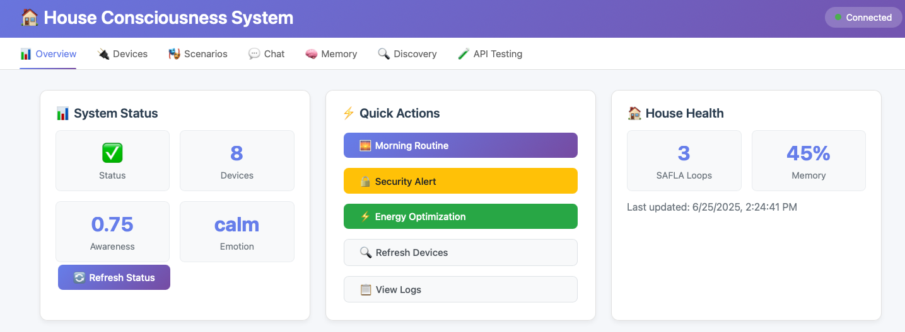

# Consciousness

## Status Updates
June 22, 2025 - wrote this README file and saved two old blog posts into references. This is the entire setup that was used to create this whole project.

June 23, 2025 - Initial agent swarm setup using claude-flow created planning documents in /plans. Reviewing the plans and iterating on them before moving on. Claude did initial research with Claude Opus 4 which is ideal, then hit limits and dropped back to Claude Sonnet 4 for the more detailed production of plans. Project setup, database implementation and conciousness engine coded.

June 24, 2025 - Modified plans to include digital twin and simulator. Told claude-flow to finish building the project and pushed code. Created INSTALLATION and USER guides. Runs with a basic Web UI. Plenty more debug to do, but this is impressive for a few hours elapsed development time over two days!

June 25, 2025 - Asked claude-flow to create a web UI that excercises every API call, as the initual UI was very bare bones. It created a more sophisticated UI with authentication that I didn't want at this stage, so spent some time removing and simplifying things. Got a bit more functionality tested, but was mostly fussing with the UI and API and git stuff I don't understand.

june 26, 2025 - Started a new Codespace, fixed the API and uodated UI, this version works as a rough demo with functionality missing. 



## Quick Installation

Get started in 5 minutes:

```bash
# Clone the repository
git clone https://github.com/adrianco/consciousness.git
cd consciousness

# Set up Python virtual environment (recommended)
python3 -m venv consciousness-env
source consciousness-env/bin/activate  # Linux/macOS
# consciousness-env\Scripts\activate   # Windows

# Install the application
pip install -e .

# Create configuration
cp .env.example .env

# Start the system
python -m consciousness.main
```

Open http://localhost:8000 to access the web interface.

**📖 For detailed installation instructions** including platform-specific setup, Docker deployment, and troubleshooting, see [INSTALLATION.md](INSTALLATION.md).

**👤 For usage instructions** and getting started guide, see [USER.md](USER.md).

## What follows below is the unmodified initial concept that was used as the basis of all the development performed by claude-flow ina few hours over two days.
## Observability and Introspection System

Based on ideas from this blog post I wrote a few years ago [Perhaps Conciousness is Just Human Observability](https://medium.com/@adrianco/perhaps-consciousness-is-just-human-observability-84dfda40d70f) (extracted text included in references directory) I would like to be able to have a conversation with an autonomous system to understand how it is feeling, why it did something, and what is bothering it.

If my self driving car was conscious, I could ask it why it did something, it could tell me it's worried and slowing down because it's raining, or that it saw a deer at the side the road (that I didn't see) and braked hard, it could say that the pressure in one of it's tires has been dropping slowly over the last few days so I should get it checked for a puncture before I go on a long drive. However I don't have a way to interface into my cars to build this.

If my house was conscious, it could tell me that it's worried about the storm that's forecasted, that we left the heating on in the guest house when no-one is staying there, that the aircon filters are getting clogged or that the furnace has failed because it's asking for heat/cool but not responding. It would know who lives here, I could tell it that we expect visitors, or are leaving the house empty and it would understand the context. There are a large number of independent IoT based systems around my house, from multiple vendors, some of which have APIs and some just have mobile apps or web interfaces. It seems plausible to develop a system that figures out how to create interfaces to different aspects of the house, and to feed them into something like a [Self Aware Feeback Loop Algorithm](https://github.com/ruvnet/safla) that has a mental model scoped to entities and activities related to living in a relatively complicated connected house.

## Scope, Examples and Conversations

### Entities and Environment For Houses
- Climate, Memories of notable weather events
- Weather, the situation now
- Emotion – bored, happy/satisfied, excited, unhappy
- Mood – accumulated emotion over time
- Health status
- Pain – memories of bad things to avoid
- Pleasure – memories of good days
- Events - people coming and going, maintenance
- Entities – people, devices, rooms, spaces outside and systems around the house

Joke reference - Marvin from the Hitchhikers Guide for the Galaxy “I’ve got a pain in the diodes down my left hand side.”

### Climate and Seasons Examples
- Winter – Nov to April
- Summer – May to August
- Hurricane/Storm Season – Sept to Oct
- Length of day variation
- Temperature - is the pool heater needed or not?
- Rainy season or fire season
- Bugs / Mosquitoes season

Hurricane, storm, nearby fire preparation
- Wind - need to pack stuff away
- Power cuts
- Fires
- Possible house damage

Memories of hurricanes etc.

### Calendar Patterns & Activities Examples
- Pool guy, yard workers or cleaners - normal behavior on a schedule
- Other visitors are unusual → notify and question the owner, record
- Owners could be home or away – remember calendar entries and flights, prepare for return

### Energy management - Cooling, heating, lighting and charging
- Air conditioning zone management based on owner and guest activity
- Hot water schedule
- When are guests staying, or larger groups and parties
- Ask owner "Guest coming, guest space hot water heater is off, want it on?" → Yes for 6 days
- Battery backup levels
- Electric car charging schedule

### Health Checks and Pain
Assume that most houses have things that are known to not be working at the moment
- Is Heating / cooling working properly?
- Hot water supply
- High winds / storms
- Water pressure
- Leaks & floods
- Frost / snow
- Power outage
- Internet connection outage

### house context-aware conversation examples
Detected owner is up: “Good morning, do you want to open the blinds and turn off the lights? Anything else happening today?”
→ "yes, and we have a plumber coming to fix a leak between 10 and noon"

“Good evening, do you want to setup for dinner inside or outside?”
→ "inside"
"Room scenes set in kitchen and dining room... anything else?"
→ "turn on <your choice of music> in those rooms

"Rain / storm / hurricane forecast for later — is everything put away outside, or would you like a reminder to do that at 3pm?"

"It’s going to be hot today, do you want to turn on the AC?"
→ "yes" → "OK, check windows are closed"

"Stuff being delivered today — should I open the gate?"

"Pool or yard worker comes today — should I close blinds when the gate is opened?"

### Troubleshooting + Emotional Check-ins
"AC is running but not cooling in the hallway. Something isn’t right. Did someone call for service?"
→ "yes"
→ "How many days to fix?" → 4
→ "Duly noted."

"AC seems better now, did it get fixed?"
→ "yes"
→ "Good, I'm happy now"

### How do you feel?
- Happy — everything is working fine and it’s a nice day
- Worried — bad weather coming
- Bored — nothing much happened recently
- Excited — lots going on

## Development Architecture
Coded in Python, with a service running on something like a Mac Mini somewhere in the house, calling out to APIs and web interfaces as needed.

Mobile single page web app that surfaces a basic interface to the owners and guests. iOS app if needed to support notifications and spoken interface.

Architecture consiste of a control loop along the lines of the STPA model described in the blog post [Failure Modes and Continuous Resilience](https://medium.com/@adrianco/failure-modes-and-continuous-resilience-6553078caad5), text of this post is supplied in the references folder.
The house is a system that has many "Observability" interfaces. The observable inputs feed a "Consciousness" model. Some aspects of the house system can be manipulated via "Controllability" interfaces.

One big problem is that in general every house has a different set of interfaces to a wide variety of devices and "Internet of Things" related products. The novel solution to this is that the LLM itself will learn what devices exist via a conversation with the house owner, then research, configure and write code to build whatever interfaces are needed. To do this a secure way to store passwords and credentials is needed.

Example conversations:
LLM: Do you have devices controlled by Apple Homekit, Google Home, Amazon Alexa or Home Assistant?
Owner: We have lots of Apple Homekit devices and some Amazon Alexa devices, no Google Home or Home Assistant here.
LLM: ..works through a discovery process to find the devices..

LLM: tell me about any systems or interfaces that record actual temperature or weather information at your location, otherwise we can use the local weather forecast.
Owner: There are three local systems, one is a Tempest weather station that records rain, wind etc, the second is an Ambient Weather unit that records temperatures inside and outside the house, and a floating swimming pool temperature monitor, the third is a separate Ambient Weather unit that records PM2.5 smoke levels outside.
LLM: (after researching how Tempest works) In the settings for the Tempest, there's a URL for public data, what's the station number?
Owner: ..nnnnnnnn..
LLM: (after researching how Ambient Wather works) for the Ambient Weather units, their MAC address is what identifies them, what are they?
Owner: The temperature monitor is aa:bb:cc:dd:ee and the PM2.5 monitor is vv:ww:xx:yy:zz
LLM: ok, I'll go and build interfaces to those devices.

LLM: Do you have any solar power, battery or energy monitoring systems?
Owner: Yes we have solar and Tesla Powerwalls.
LLM: Cool, there's an API I can use via github.com/jasonacox/pypowerwall to see the battery and solar and house usage.

LLM: What do you use for heating and cooling, do you have any connected thermostats?
Owner: We have several Mitsubishi heat pumps, and they use a Mitsubishi Comfort app that says it has Google Home and Alexa interfaces available, but not configured.
LLM: It appears that the latest Mitsubishi Comfort app doesn't have a working Alexa skill at the moment, but there are some github projects that document the Mitsubishi Kumo API for tools like Home Assistant that we can leverage to figure out how to talk to the heat pumps.
