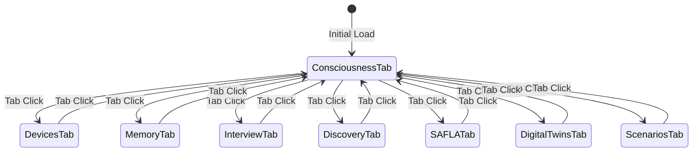

# House Consciousness Dashboard UI Flow Documentation

## Table of Contents
1. [Dashboard Architecture Overview](#dashboard-architecture-overview)
2. [Navigation Patterns](#navigation-patterns)
3. [Component Interaction Flows](#component-interaction-flows)
4. [Responsive Design Patterns](#responsive-design-patterns)
5. [Real-time Updates & WebSocket Integration](#real-time-updates--websocket-integration)
6. [UI State Management](#ui-state-management)
7. [Error Handling & Recovery](#error-handling--recovery)
8. [UI Best Practices](#ui-best-practices)

## Dashboard Architecture Overview

The House Consciousness Dashboard is a single-page React application with a tab-based navigation system. It provides a comprehensive interface for managing smart home devices, interacting with the consciousness system, and monitoring home automation.

### Key Components:
- **Header**: Brand identity, version display, and connection status
- **Navigation Tabs**: 8 primary sections for different functionalities
- **Main Content Area**: Dynamic content based on active tab
- **Real-time WebSocket**: Live updates and bidirectional communication

## Navigation Patterns

### Tab-Based Navigation Structure

The dashboard uses 8 primary tabs, each serving a specific purpose:

1. **Consciousness Tab** (Default)
   - System status overview
   - Emotional state monitoring
   - Interactive chat interface

2. **Devices Tab**
   - Device filtering and search
   - Batch control operations
   - Individual device management

3. **Memory Tab**
   - Memory bank browsing
   - New memory creation
   - Memory type categorization

4. **Interview Tab**
   - Conversational device discovery
   - Step-by-step setup wizard
   - AI-guided configuration

5. **Discovery Tab**
   - Network protocol scanning
   - Multi-protocol device detection
   - Discovery results management

6. **SAFLA Tab**
   - Loop monitoring
   - Manual trigger controls
   - Status visualization

7. **Digital Twins Tab**
   - Twin creation and management
   - Fidelity level configuration
   - Synchronization status

8. **Scenarios Tab**
   - What-if analysis
   - Scenario building
   - Predictive modeling

### Navigation Flow States



## Component Interaction Flows

### 1. Dashboard Loading Flow

```
1. Page Load
   ├── Initialize React App
   ├── Enable Demo Mode (if needed)
   ├── Establish WebSocket Connection
   └── Load Default Tab (Consciousness)
       ├── Fetch System Status
       ├── Fetch Emotional State
       └── Initialize Chat Interface
```

### 2. Consciousness Chat Interaction

```
User Input → Form Submission → Loading State
    ↓
Add User Message to Chat
    ↓
API Call (/api/consciousness/query)
    ↓
Receive AI Response
    ↓
Update Chat Messages → Scroll to Bottom
```

### 3. Device Control Flow

```
Device List Load
    ├── Apply Filters (status, location, type)
    ├── Render Device Cards
    └── Enable Selection Checkboxes

Individual Control:
    Device Card → Click Action Button → API Call → Update State

Batch Control:
    Select Devices → Show Batch Actions → Execute Command → Clear Selection
```

### 4. Memory Creation Flow

```
Click "Add Memory" → Show Form Modal
    ↓
Select Memory Type (experience/pattern/preference/interaction)
    ↓
Enter Content → Submit Form
    ↓
API Call → Update Memory List → Hide Form
```

### 5. Interview Wizard Progression

```
Start Interview → Display AI Greeting
    ↓
User Describes Devices → AI Processes
    ↓
AI Asks Follow-up → User Responds
    ↓
Continue Until Complete → Store Configuration
```

### 6. Device Discovery Process

```
Select Protocols → Start Scan
    ↓
Show Progress Indicator
    ↓
Poll for Results (2s intervals)
    ↓
Display Found Devices by Protocol
    ↓
Option to Add Devices to System
```

## Responsive Design Patterns

### Desktop Layout (1400px max-width)
- Full navigation bar with all tabs visible
- Grid layouts: 2-4 columns based on content
- Side-by-side panels for status and chat
- Expanded device cards with all controls

### Tablet Adaptation (768px - 1024px)
- Horizontal scrollable navigation tabs
- Grid adjusts to 2 columns maximum
- Stacked layout for consciousness status
- Compact device cards

### Mobile Phone Layout (<768px)
- Hamburger menu for navigation (future enhancement)
- Single column layout
- Vertically stacked components
- Touch-optimized controls
- Larger tap targets (min 44px)

### Responsive Grid System

```css
/* Auto-responsive grids */
.grid-2: minmax(400px, 1fr)
.grid-3: minmax(300px, 1fr)  
.grid-4: minmax(250px, 1fr)
```

## Real-time Updates & WebSocket Integration

### WebSocket Connection Flow

```javascript
Connection States:
1. Connecting → Show "Connecting..." status
2. Connected → Green pulse indicator
3. Disconnected → Red indicator + Auto-reconnect (5s)
4. Error → Log error + Attempt reconnection
```

### Real-time Event Handling

```
WebSocket Message Types:
├── consciousness_query: Update last query state
├── device_update: Refresh specific device
├── batch_device_update: Update multiple devices
├── interview_update: Progress interview state
└── status_update: System-wide status refresh
```

### Update Patterns

1. **Optimistic Updates**: Immediate UI feedback before API confirmation
2. **Debounced Updates**: Prevent excessive API calls during rapid changes
3. **Selective Re-rendering**: React.memo prevents unnecessary component updates

## UI State Management

### State Architecture (UIStateManager)

```javascript
State Structure:
{
  consciousness: { status, emotions, lastQuery, isActive },
  devices: { list, currentDevice, discoveryResults },
  memory: { entries, recentMemories },
  interview: { currentSession, messages, status },
  safla: { status, activeLoops, lastTrigger },
  twins: { list, currentTwin, scenarios },
  ui: { activeTab, showModal, modalData, notifications }
}
```

### State Update Patterns

1. **Nested Updates**: `setNestedValue()` for deep state updates
2. **Subscriptions**: Component-level state subscriptions
3. **Batch Updates**: Group related state changes
4. **Persistence**: LocalStorage for user preferences

## Error Handling & Recovery

### Error States

1. **Connection Errors**
   - Display offline indicator
   - Queue actions for retry
   - Auto-reconnect with exponential backoff

2. **API Errors**
   - Show contextual error messages
   - Provide retry options
   - Fallback to cached data

3. **Form Validation**
   - Inline field validation
   - Clear error messages
   - Prevent submission of invalid data

### Recovery Patterns

```
Error Detection → Log Error → Show User Feedback
    ↓
Determine if Retryable
    ├── Yes: Queue for Retry → Exponential Backoff
    └── No: Show Error State → Provide Manual Recovery
```

## UI Best Practices

### 1. Loading States

```javascript
// Skeleton Loading Pattern
if (loading) {
  return (
    <div className="loading">
      <div className="spinner"></div>
      Loading {contentType}...
    </div>
  );
}
```

### 2. Empty States

```javascript
// Informative Empty States
if (items.length === 0) {
  return (
    <div className="empty-state">
      <p>No {itemType} found</p>
      <button onClick={createNew}>Create First {itemType}</button>
    </div>
  );
}
```

### 3. Confirmation Dialogs

```javascript
// Critical Action Confirmation
const confirmAction = () => {
  uiState.showModal(
    'Confirm Action',
    'Are you sure you want to proceed?',
    [
      { text: 'Cancel', class: 'btn-secondary', onclick: 'uiState.hideModal()' },
      { text: 'Confirm', class: 'btn-primary', onclick: executeAction }
    ]
  );
};
```

### 4. Progress Indicators

1. **Determinate Progress**: Show percentage for known operations
2. **Indeterminate Progress**: Spinner for unknown duration
3. **Stepped Progress**: Multi-step wizards with clear progression

### 5. Accessibility Considerations

- **ARIA Labels**: All interactive elements have descriptive labels
- **Keyboard Navigation**: Tab order follows logical flow
- **Focus Management**: Proper focus states and indicators
- **Color Contrast**: WCAG AA compliant color combinations
- **Screen Reader Support**: Semantic HTML structure

### 6. Performance Optimizations

1. **React.memo**: Prevent unnecessary re-renders
2. **Lazy Loading**: Load tab content on demand
3. **Debouncing**: Limit API calls during user input
4. **Virtual Scrolling**: For large device lists (future)
5. **Image Optimization**: Lazy load device images

### 7. Notification Patterns

```javascript
// Notification Types and Duration
Info: 5 seconds (auto-dismiss)
Success: 3 seconds (auto-dismiss)
Warning: 10 seconds (manual dismiss)
Error: No auto-dismiss (requires user action)
```

### 8. Form Interaction Best Practices

1. **Auto-save**: Draft preservation for long forms
2. **Field Validation**: Real-time validation feedback
3. **Smart Defaults**: Pre-populate sensible values
4. **Clear Actions**: Prominent submit/cancel buttons
5. **Progress Preservation**: Maintain state during navigation

### 9. Mobile-First Considerations

- Touch targets minimum 44x44px
- Swipe gestures for navigation (future)
- Simplified layouts for small screens
- Reduced data density on mobile
- Offline-first architecture

### 10. Animation Guidelines

```css
/* Consistent animation timing */
Micro-interactions: 200-300ms
Page transitions: 300-400ms
Loading states: Infinite with easing
Hover effects: 150ms ease-in-out
```

## Future Enhancements

1. **Progressive Web App (PWA)**: Offline functionality and installability
2. **Voice Control**: "Hey House" voice commands
3. **Dashboard Customization**: Drag-and-drop widget arrangement
4. **Multi-language Support**: i18n implementation
5. **Dark Mode**: System-aware theme switching
6. **Advanced Analytics**: Usage patterns and insights
7. **3D Home Visualization**: Spatial device representation
8. **Gesture Controls**: Touch and motion gestures
9. **Predictive UI**: AI-driven interface adaptations
10. **Cross-device Sync**: Seamless experience across devices