# House Consciousness Dashboard User Journey Maps

## Primary User Journeys

### 1. First-Time Setup Journey

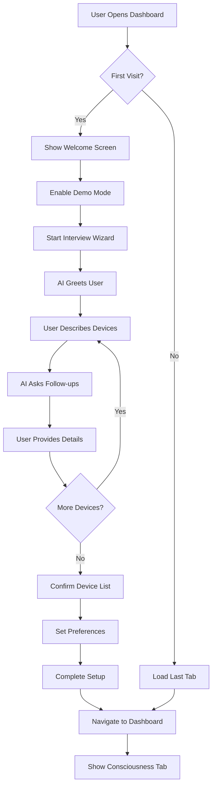

### 2. Daily Interaction Journey

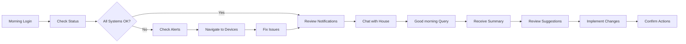

### 3. Device Control Journey

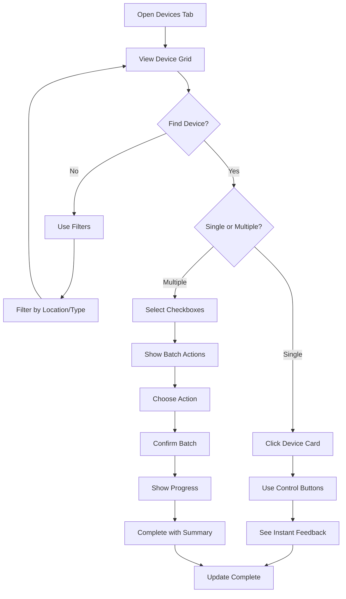

### 4. Memory Creation Journey

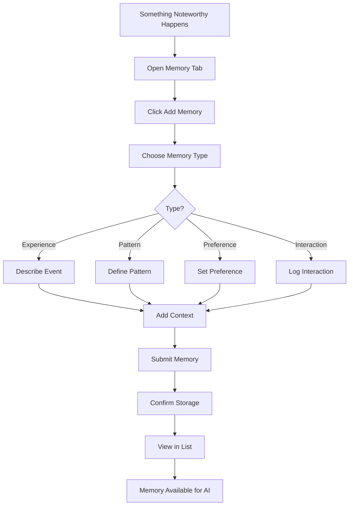

### 5. Discovery Process Journey

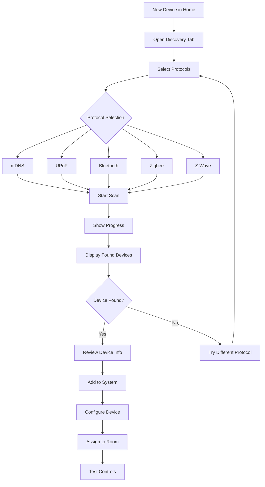

### 6. What-If Analysis Journey

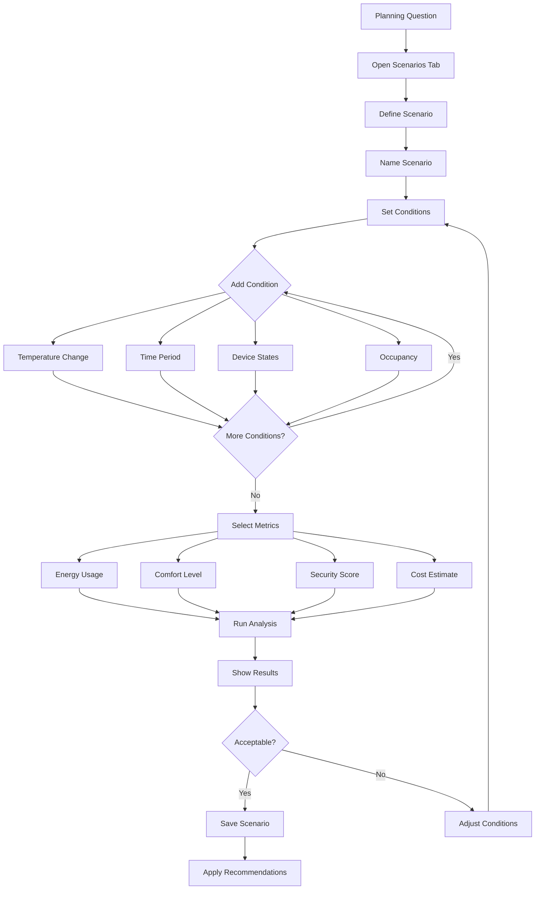

### 7. SAFLA Monitoring Journey

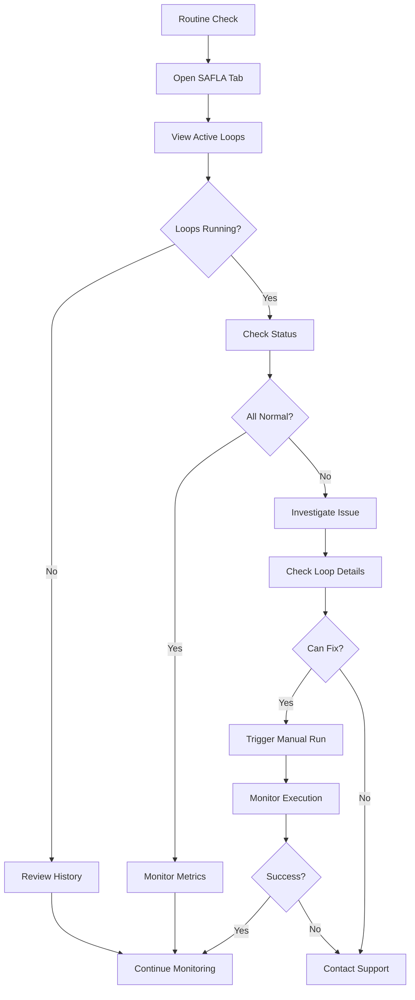

### 8. Digital Twin Management Journey

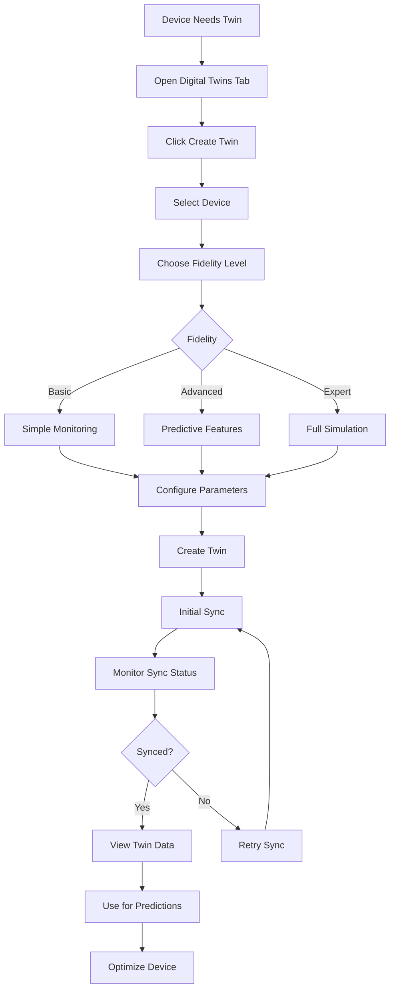

## Error Recovery Journeys

### Connection Lost Journey

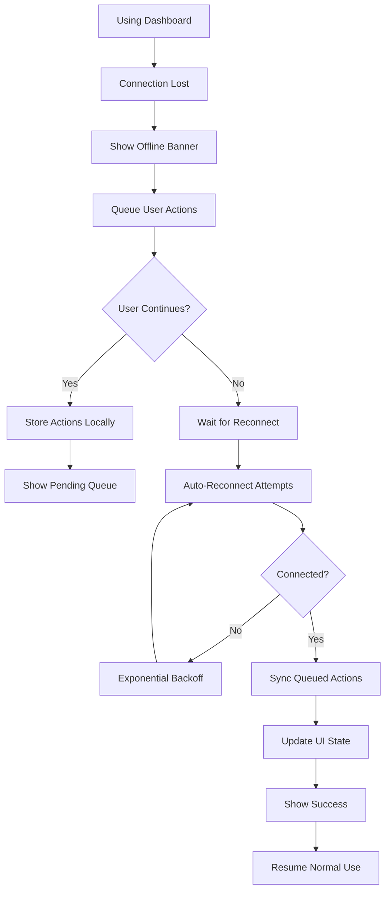

### Device Control Failure Journey

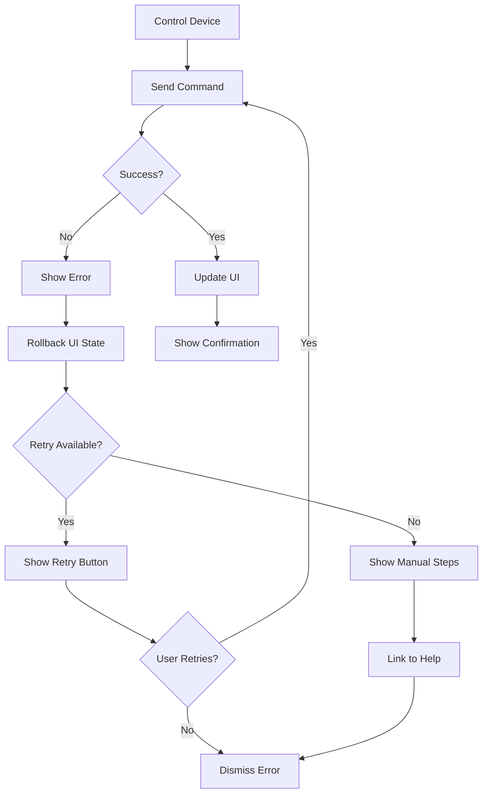

## Accessibility Journeys

### Keyboard Navigation Journey

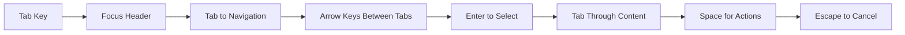

### Screen Reader Journey

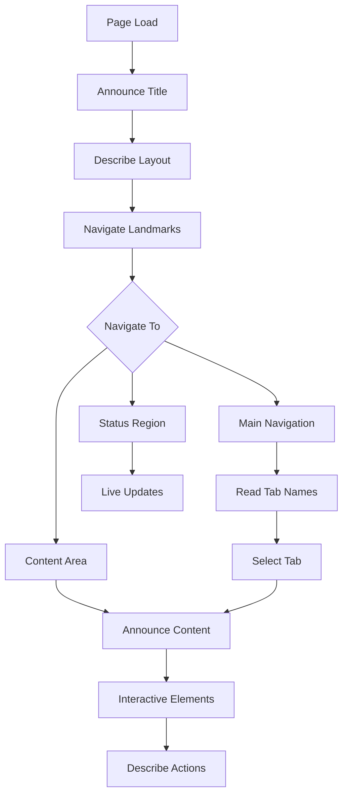

## Mobile-Specific Journeys

### Mobile Device Control

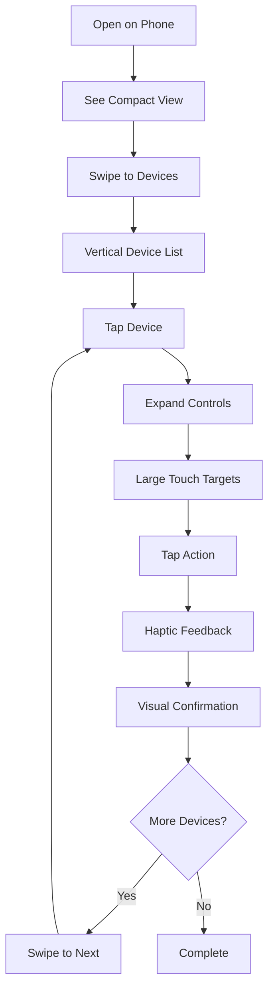

### Mobile Chat Experience

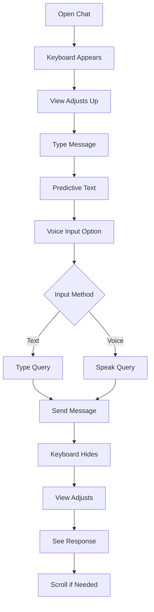

## Advanced User Journeys

### Power User Batch Operations

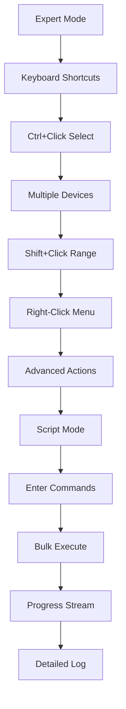

### Data Analysis Journey

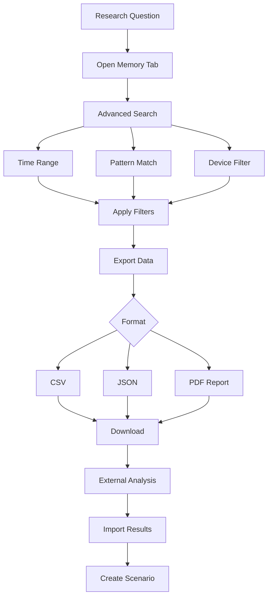